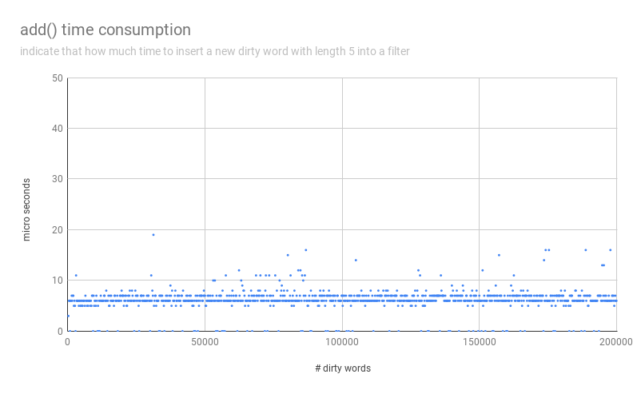

# trevi-interview

A multi-pattern string filter implement by [Aho–Corasick algorithm](https://en.wikipedia.org/wiki/Aho%E2%80%93Corasick_algorithm).

# Build

* Clone repository and the submodule.

    ```
    git clone git@github.com:yarencheng/trevi-interview.git
    cd trevi-interview/
    git submodule init
    git submodule update
    ```

* Build and pack the executable binary in to docker image.

    `docker build --tag trevi-interview .`

# Interactive mode

Start interactive mode with docker image.

`docker run -it --rm trevi-interview filter`

## Usage

Input anything.

```
abc
> abc
```

Add dirty word by appending `+`

```
abc
> abc
+b
```

Words is mask by `*` if it contains dirty words.

```
abc
> abc
+b
abc
> a*c
```

`中文` is OK

```
我是中文
> 我是中文
+是中
我是中文
> 我**文
```

Search dirty words by appending `?`

```
+b
+bc
+bcd
?b
>  [bcd, b, bc]
```

Enter a empty string to exit

```
aaa
> aaa


EXIT

```

# Complexity

* `ACCFilter::add(dirtyWord)`
    * `n`: length of input `dirtyWord`
    * time complexity: `O(n)`
    * space complexity: `O(n)`

* `ACCFilter::build()`
    * `N`: total length of all dirty words
    * time complexity: `O(N)`
    * space complexity: `O(N)`

* `ACCFilter::filter(sentence)`
    * `m`: length of input `sentence`
    * `l`: Total appearance of each dirty word
    * time complexity: `O(m + l)`
    * space complexity: `O(m + l)`

* `ACCFilter::search(pattern)`
    * `N`: total length of all dirty words
    * `l`: total number of dirty words matched by `pattern`
    * time complexity: `O(N + l)`
    * space complexity: `O(l)`

# Profiling mode

## How to run
Enable Profiling mode with additional parameter `filter --profiling`.
A CSV file `report.csv` is generated inside `pwd` in the end.
For more parameters, see `filter --help`.

```
docker run -it --rm \
    --volume `pwd`/:/workdir \
    trevi-interview \
    filter --profiling
```

## How it works

1. add 199 dirty words
2. add one dirty word
3. re-build ACC tree
4. give a pattern, and search all matched dirty words.
    * repeat 5 times, and get average time consumption
5. give a sentence, and filter with all dirty words.
    * repeat 5 times, and get average time consumption
6. record each time consumption of step 2~5
7. repeat step 1~6 until reach 200000 dirty words.
8. Note:
    * length of a dirty word is 5
    * length of a pattern is 2
    * length of a sentence is 100
    * each character in a random string is `[0-9a-zA-Z]`

## Column in `report.csv`

* Column `# dirty words`: Total number of dirty words in the filter
* Column `add() ms`: Time consumption of `add()`
* Column `build() ms`: Time consumption of `build()`
* Column `search() ms`: Time consumption of `search()`
* Column `filter() ms`: Time consumption of `filter()`
* time unit: micro second

```
[report.csv]
# dirty words, add() ms, build() ms, search() avg ms, filter() avg ms
...
29512,11,134143,30527.5,145
29513,13,139004,29915,133
29514,12,144974,29585,124
29515,11,133373,29592,93.6
29516,10,127857,31181.5,148.8
29517,11,148383,31004.5,159
29518,11,127867,29825.5,144
...

```
## Sample




